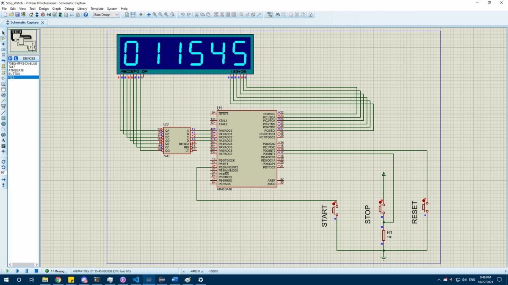

# Stop Watch

A simple stop watch project built with 6 seven segments (hours, minutes and seconds).
the maximum time is 99 hours, 59 minutes and 59 seconds and then the timer resets.
This stop watch is running on ATMega16 microcontroller with 3 buttons
(stop, resume and reset).

Mainly this project was built for testing all the drivers that I have made so far. 
Code layering has been put into consideration. 
Used in Project: 
MCAL : Timers, External Interrupts, GPIO 
HAL : Button, Seven Segment Display

# Stop Watch in Action
This is a GIF showing the stop watch working fine after 1 hour, 16 minutes and 45 seconds

